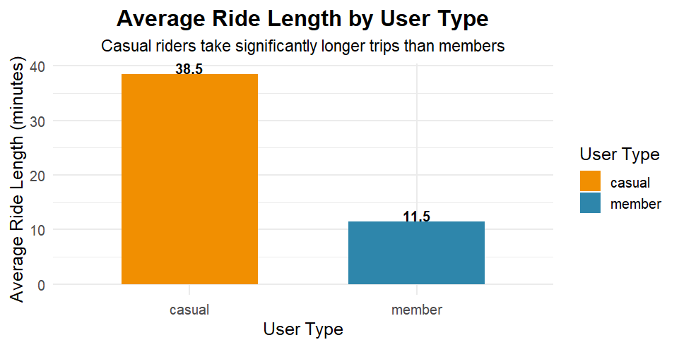
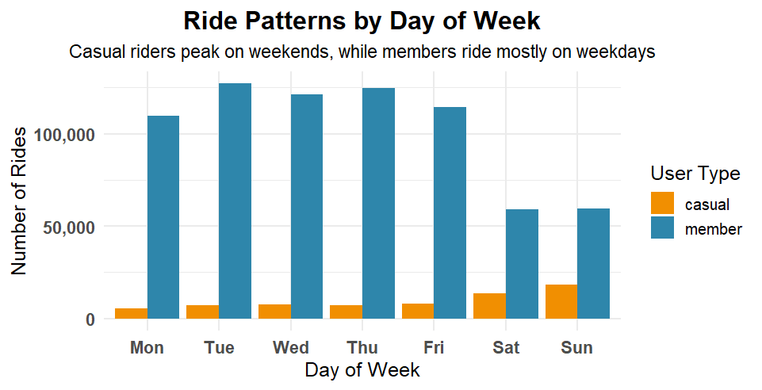
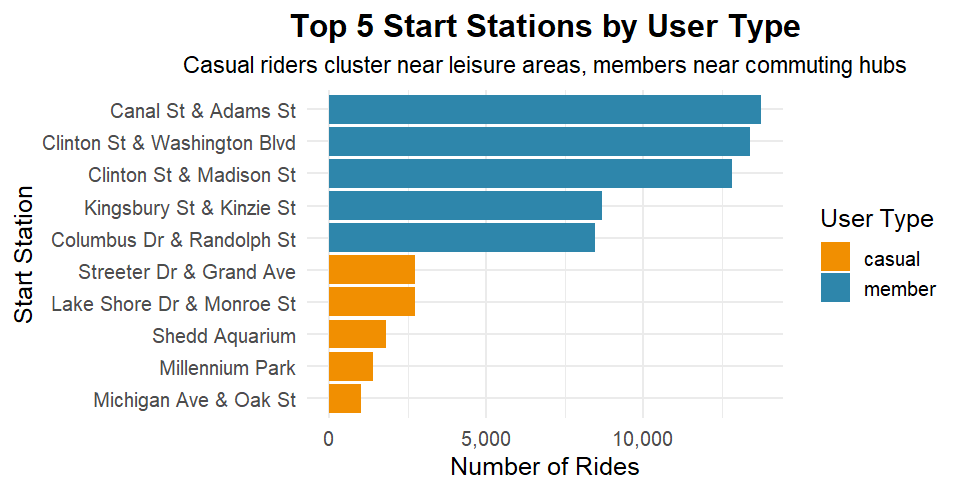

# Cyclistic Bike-Share Case Study  

## Overview  
This project is part of the **Google Data Analytics Professional Certificate Capstone**.  

The objective is to analyze **Cyclistic’s bike-share data** to understand how casual riders and annual members use the service differently. Insights are then used to recommend strategies that convert casual riders into paying members, ultimately boosting revenue.  

---

## Business Task  
Design **data-driven marketing strategies** to maximize annual memberships by:  
- Identifying behavioral differences between casual riders and members.  
- Highlighting patterns in ride duration, frequency, and seasonality.  
- Supporting recommendations with visual evidence.  

---

## Datasets  
The data comes from **Divvy (Cyclistic) trip data**, made publicly available by Motivate International Inc.  

- [Divvy Trips Q1 2019 – Raw](https://www.kaggle.com/datasets/hamzajawad123/divvy-trips-2019-q1-dataset)
- [Divvy Trips Q1 2020 – Raw](https://www.kaggle.com/datasets/hamzajawad123/divvy-trips-2020-q1-datasets)
- [Cleaned Dataset](https://www.kaggle.com/datasets/hamzajawad123/cleaned-merged-final-2019-2020-dataset)  

> Note: Due to GitHub file size restrictions, the datasets are hosted on **Kaggle**.  

---

## Process  
The analysis followed the **six-step data analysis framework**:  

1. **Ask** – Define the problem: “How do annual members and casual riders use Cyclistic bikes differently?”  
2. **Prepare** – Collect and combine 2019 Q1 and 2020 Q1 datasets.  
3. **Process** – Clean data (remove nulls, duplicates, inconsistencies).  
4. **Analyze** – Compare ride patterns, durations, weekly trends, and seasonal differences.  
5. **Share** – Build reports, dashboards, and visualizations to communicate findings.  
6. **Act** – Recommend strategies to convert casual riders into members.  

---

## Key Insights  
- **Casual riders**: Longer average ride durations but less frequent use.  
- **Members**: Shorter rides but more consistent daily and weekly usage.  
- **Seasonality**: Casual rider usage peaks during weekends and warmer months.  
- **Potential Growth**: Targeting casual riders with flexible membership packages can increase conversions.  

---

## Tech Stack  
  
  
  

---

## Deliverables  
- [Case Study Report (PDF)](./deliverables/Cyclistic_Case_Study_Report.pdf)  
- [PowerPoint Presentation](./deliverables/Cyclistic_Case_Study_Presentation.pptx)  
- [Data Cleaning Script (R)](./scripts/data_cleaning.R)  
- [Exploratory Data Analysis (R)](./scripts/eda_analysis.R)  

---

## Sample Visualizations  

Here are a few key visualizations generated during the analysis:  

**Visualization 1: Average Ride Length by User Type**  
This chart compares the average ride duration between **casual riders** and **annual members**, highlighting differences in usage behavior.  
  

---

**Visualization 2: Ride Patterns by Day of Week**  
This visualization shows ride frequency across days of the week, helping identify peak usage times for both casual and member riders.  
  

---

**Visualization 3: Top 5 Start Stations by User Type**  
This chart highlights the most popular starting stations, segmented by user type, which can inform targeted marketing strategies.  
  

---

## Recommendations  
1. Introduce **weekend passes** to appeal to casual riders.  
2. Offer **discounted trial memberships** for frequent casual users.  
3. Use **personalized marketing campaigns** highlighting cost savings of memberships.  
4. Partner with **local events** (festivals, sports) to capture seasonal casual users.  

---

## About This Project  
This case study demonstrates **real-world data analytics skills** including:  
- Data cleaning and wrangling  
- Exploratory and statistical analysis  
- Data visualization  
- Business storytelling  
- Actionable recommendations  

---

## Acknowledgements  
- Data provided by [Motivate International Inc.](https://divvybikes.com/system-data) under public use agreement.  
- Case study inspired by the **Google Data Analytics Professional Certificate**.  

---
